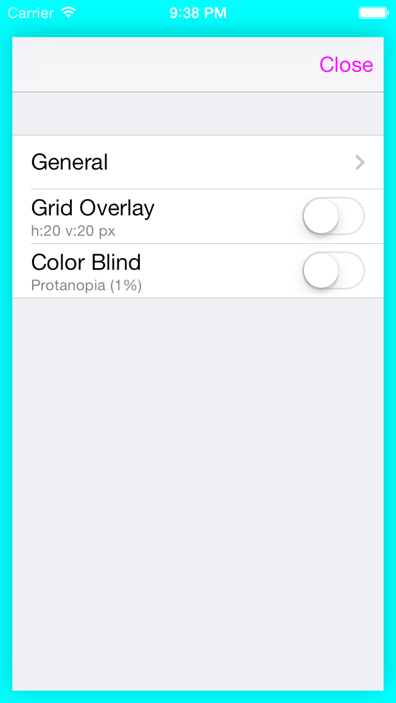

iOS App Beta Test Settings
==========================

Easy accesible in-app settings for testing. Shake to show settings-panel.

## Use 

### 1. Import to project with wanted plugins

```objective-c
#import "DMTestSettings.h"
#import "DMGridOverlayPlugin.h"
```

### 2. Add to app launch

```objective-c
- (BOOL)application:(UIApplication *)application didFinishLaunchingWithOptions:(NSDictionary *)launchOptions
{
  ...
  self.window.rootViewController = ...;
  
  // Start DMTestSettings _after_ setting rootViewController 
  [DMTestSettings startWithPlugins:@[[DMGridOverlayPlugin new]]];
  
  return YES;
}
```
    
### 3. Shake to show settings panel

Or use ctr+cmd+z in iOS Simulator.


## Working plugins

### Grid overlay
Overlay point grid to check alignments of UI elements such as buttons and labels.

### Color-blind test
Color-grades the entire UI to simulate color-blind conditions

See https://github.com/duemunk/iOS-App-Beta-Test-Settings/wiki/Plugins
