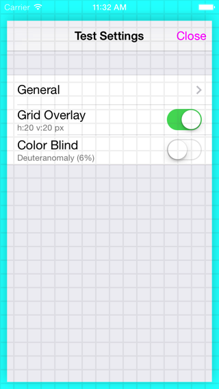

iOS App Beta Test Settings
==========================

Easy accesible in-app settings for testing. Shake to show settings-panel.

## Use 

### 1. Import to project with wanted plugins

```objective-c
#import "DMTestSettings.h"
```

### 2. Add to app launch

```objective-c
- (BOOL)application:didFinishLaunchingWithOptions:
{
  ...
  self.window.rootViewController = ...;
  
  // Start DMTestSettings _after_ setting rootViewController 
  [DMTestSettings start];
  
  return YES;
}
```
    
### 3. Shake to show settings panel


Or use ⌃⌘Z in iOS Simulator.

### 4. Use the test suite of plugins




## Working plugins

### Grid overlay
Overlay point grid to check alignments of UI elements such as buttons and labels.

### Color-blind test
Color-grades the entire UI to simulate color-blind conditions.

See [here](https://github.com/duemunk/iOS-App-Beta-Test-Settings/wiki/Plugins) for more details on plugins.
