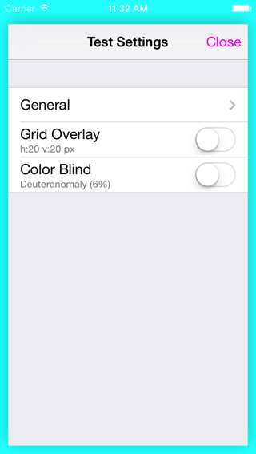

DMTestSettings
==========================
*iOS App Beta Test Settings made easy*

Easy accesible in-app settings for testing. Shake to show settings-panel.

## Use 

### 1. Import to project with wanted plugins – or CocoaPods pod "DMTestSettings"

```objective-c
#import "DMTestSettings.h"
```

### 2. Add to app launch

```objective-c
- (BOOL)application:didFinishLaunchingWithOptions:
{
  ...
  self.window.rootViewController = ...;
  [self.window makeKeyAndVisible];
  
  // Start DMTestSettings _after_ setting rootViewController 
  // _and_ after setting keyWindow
  [DMTestSettings start];
  
  return YES;
}
```
    
### 3. Shake to show settings panel




Or use ⌃⌘Z in iOS Simulator.

### 4. Use the test suite of plugins


## Working plugins

### Grid overlay
Overlay point grid to check alignments of UI elements such as buttons and labels.

### Color-blind test
Color-grades the entire UI to simulate color-blind conditions.

See [here](https://github.com/duemunk/iOS-App-Beta-Test-Settings/wiki/Plugins) for more details on plugins.

### FPS
Shows current FPS in the statusbar.

## Make your own plugins!

Add your own plugins to the test suite. These might be app-specific or not. 

```objective-c
#import "DMTestSettingsPlugin.h"
@interface DMGridOverlayPlugin : DMTestSettingsPlugin // Subclass DMTestSettingsPlugin
@end

@implementation DMGridOverlayPlugin
#define kHorizontalSpacing @"kHorizontalSpacing" // Define keys for parameters

- (void)setup
{
	self.name = @"Grid Overlay"; // Just a name :)
	self.uniqueID = @"GridOverlay"; // Unique ID used for storing parameter values
	self.parameterDefaults = @{kHorizontalSpacing	:	@(20), // Provide default values for parameters
							   kVerticalSpacing		:	@(20),
							   kLineWidth			:	@(2),
							   kLineColor			:	[UIColor grayColor],
							   kOpacity				:	@(0.8f)};
	
  // Set a view controller that acts as your control panel for the plugin.
	self.viewController = ...
}

- (void)updateToNewSettings
{
  // use self.enabled to check if plugin should be active
  // To get update to parameter values, use [[[DMTestSettings sharedInstance] objectForKey:kHorizontalSpacing withPluginIdentifier:self.uniqueID] floatValue];
}
```

```objective-c
// Setter for parameter values
[[DMTestSettings sharedInstance] setObject:@(spacing) forKey:kHorizontalSpacing withPluginIdentifier:self.uniqueID];
// Getter for parameter values
[[[DMTestSettings sharedInstance] objectForKey:kHorizontalSpacing withPluginIdentifier:self.uniqueID] 
```
